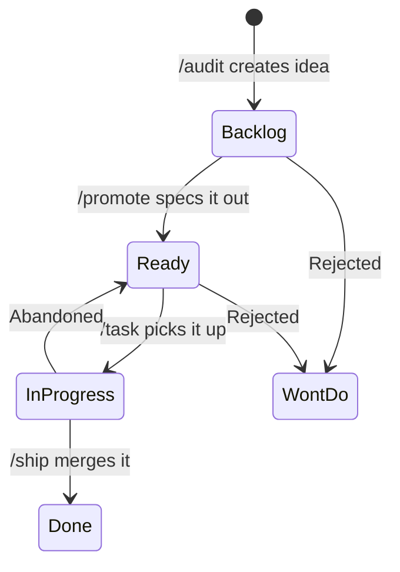
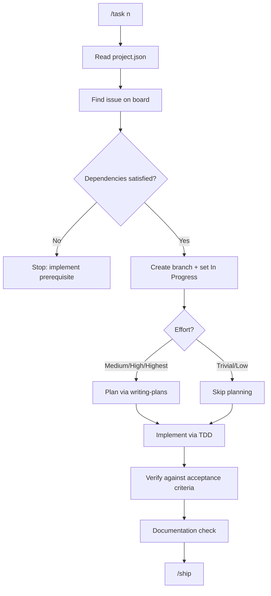
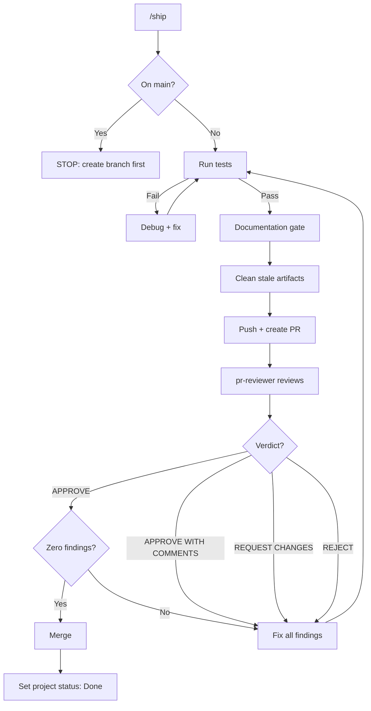
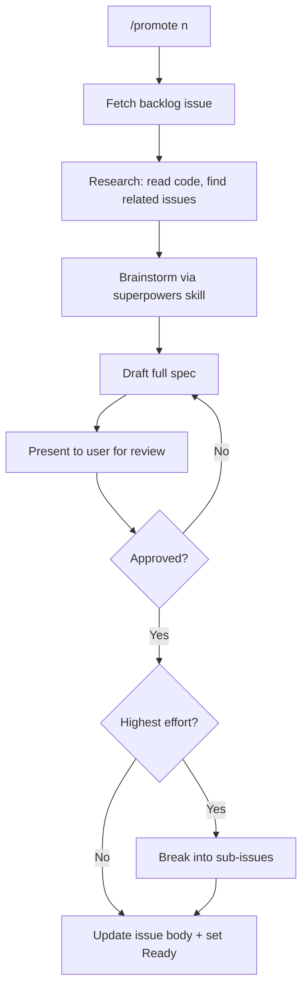
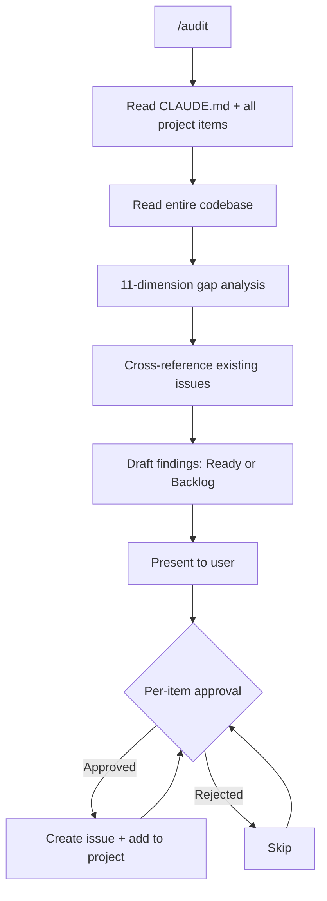
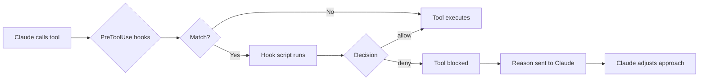

# trackness-agents

Claude Code plugin providing project management workflows, enforcement hooks, and a PR reviewer agent. Installed as a marketplace plugin — applies to all repos where enabled.

## Install

```bash
claude plugin install trackness-agents@claude-agents
```

This registers the marketplace from `trackness/claude-agents` on GitHub and installs the plugin.

## What's Included

### Agent

| Agent | Purpose |
|-------|---------|
| `pr-reviewer` | Comprehensive PR review covering architecture, security, performance, error handling, testing, and readability |

### Skills

| Skill | Purpose |
|-------|---------|
| `/setup-project` | Bootstrap a new repo with GitHub Project, labels, `.claude/project.json`, and starter CLAUDE.md |
| `/task <n>` | Implement a GitHub Issue end-to-end: find, branch, plan, build, verify, ship |
| `/ship` | Commit, PR, review, and merge the current branch |
| `/audit` | 11-dimension codebase gap analysis, generates GitHub Issues |
| `/promote <n>` | Promote a Backlog issue to Ready with full spec via research and brainstorming |

All skills except `/setup-project` require `.claude/project.json` to exist (created by `/setup-project`).

### Hooks

Enforcement hooks that block tool calls mechanically. Claude cannot bypass these.

| Hook | Blocks | Matcher |
|------|--------|---------|
| `no-commit-main.sh` | `git commit` on main/master (allows `--amend`) | Bash |
| `no-hook-bypass.sh` | `--no-verify` on any git command | Bash |
| `doc-staleness-check.sh` | `gh pr create` when substantive changes lack doc updates | Bash |
| `enforce-agent-model.sh` | Agent calls with `model: "haiku"` | Agent |
| `enforce-pr-reviewer.sh` | PR review agents that aren't `trackness-agents:pr-reviewer` | Agent |
| `enforce-memory-approval.sh` | Prompts for approval on writes to memory directory | Write |

## Project Configuration

Skills read project-specific IDs from `.claude/project.json` in each repo. This file is created by `/setup-project` and contains:

- GitHub owner, repo name, repository node ID
- GitHub Project number, node ID, all field and option IDs
- Test command (auto-detected)
- Label list

## Dependencies

System tools (must be installed):
- `gh` — GitHub CLI
- `jq` — JSON processing
- `task` — go-task runner (checked by `/setup-project` in consumer repos)
- `lefthook` — pre-commit hook manager (checked by `/setup-project` in consumer repos)

Claude Code plugins (must be enabled):
- `superpowers-extended-cc` — implementation skills (TDD, planning, debugging, verification)

## Structure

```
trackness-agents/
│
├── .claude-plugin/
│   ├── plugin.json                      # Plugin manifest (name, version)
│   └── marketplace.json                 # Marketplace definition
│
├── agents/
│   └── pr-reviewer.md                   # PR review agent prompt
│
├── hooks/
│   ├── hooks.json                       # Hook configuration (matchers + script paths)
│   ├── no-commit-main.sh               # Block commits to main (allow amend)
│   ├── no-hook-bypass.sh               # Block --no-verify
│   ├── doc-staleness-check.sh           # Block PRs without doc updates
│   ├── enforce-agent-model.sh           # Block haiku subagents
│   ├── enforce-pr-reviewer.sh           # Block wrong PR reviewer
│   └── enforce-memory-approval.sh       # Block unapproved memory writes
│
└── skills/
    ├── setup-project/
    │   ├── SKILL.md                     # Bootstrap a new repo
    │   ├── queries/
    │   │   ├── update-status-field.graphql
    │   │   ├── create-priority-field.graphql
    │   │   ├── create-effort-field.graphql
    │   │   ├── create-type-field.graphql
    │   │   └── link-project-to-repo.graphql
    │   └── templates/
    │       ├── CLAUDE.md                # Starter CLAUDE.md for new repos
    │       ├── project.json             # .claude/project.json schema
    │       └── issue-body.md            # Standard issue body format
    │
    ├── task/
    │   ├── SKILL.md                     # Implement a GitHub Issue end-to-end
    │   └── queries/
    │       ├── combined-issue-query.graphql
    │       └── create-linked-branch.graphql
    │
    ├── ship/
    │   └── SKILL.md                     # Commit, PR, review, merge
    │
    ├── audit/
    │   ├── SKILL.md                     # 11-dimension codebase gap analysis
    │   ├── queries/
    │   │   └── add-blocked-by.graphql
    │   └── templates/
    │       └── issue-body.md            # Standard issue body format
    │
    └── promote/
        ├── SKILL.md                     # Promote backlog to ready
        ├── queries/
        │   ├── add-blocked-by.graphql
        │   └── add-sub-issue.graphql
        └── templates/
            └── issue-body.md            # Standard issue body format
```

## Workflows

### Issue Lifecycle



### /task Flow



### /ship Flow



### /promote Flow



### /audit Flow



### Hook Enforcement



## Versioning

Bump the version in `.claude-plugin/plugin.json` and `.claude-plugin/marketplace.json` before pushing changes. Consumers pick up updates via `claude plugin update trackness-agents@claude-agents`.
